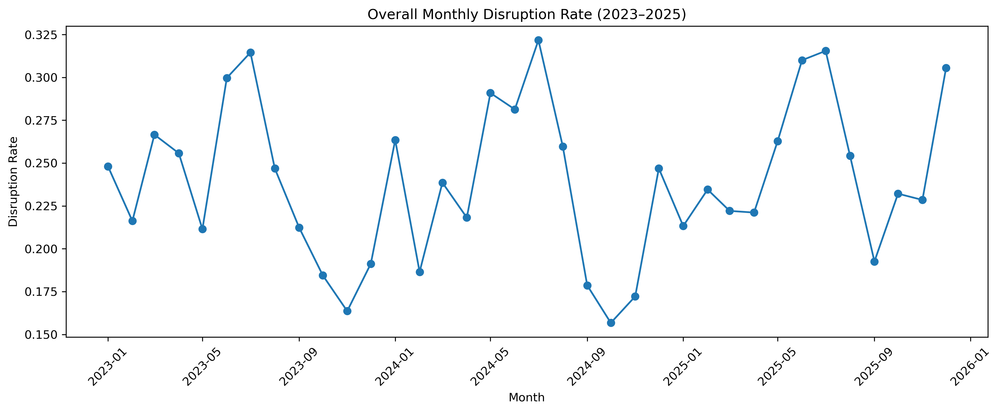
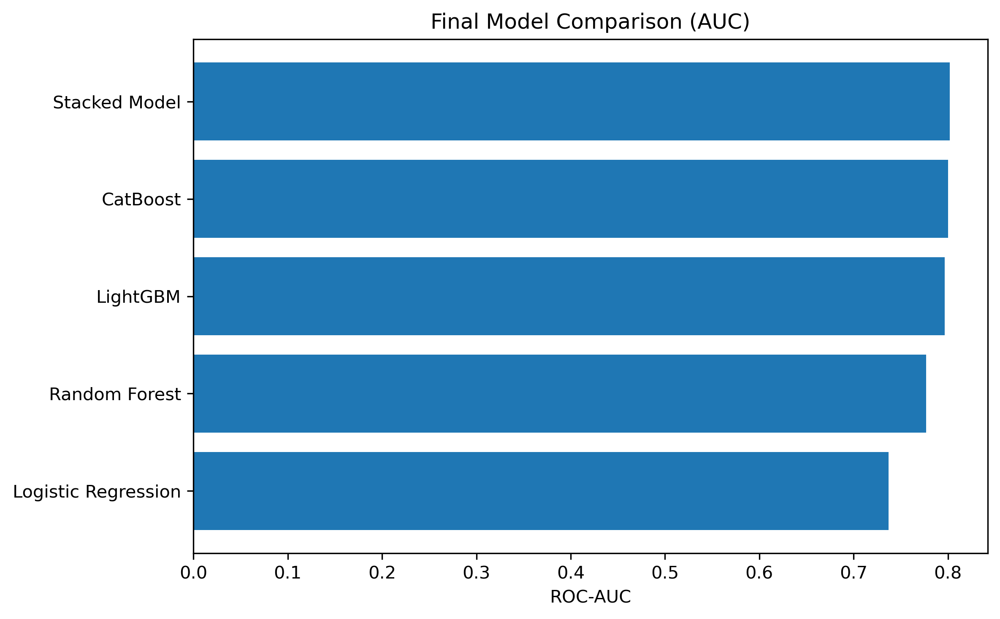
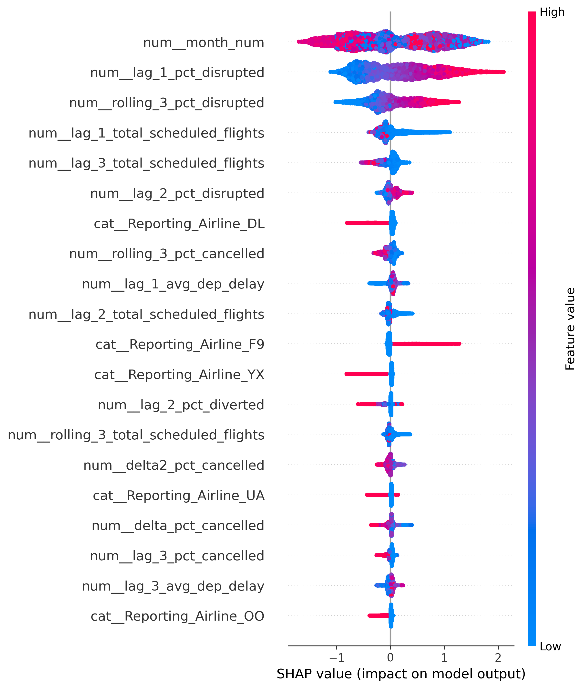

Predicting **high-disruption months** for airline–airport combinations using multi-year flight operations data and machine learning.

---

# ✈️ Airline Disruption Prediction

# 📌 Overview
This project develops an end-to-end machine learning system to predict high-disruption months for airline–airport combinations using historical flight operations data. 

The model captures temporal patterns, operational behaviour, and historical disruption trends to identify periods of elevated disruption risk.

# 🎯 Business Problem
Airline disruptions lead to a volatile environment characterized by passenger dissatisfaction, operational inefficiencies, and significant financial losses.

### **Project Objective**
Proactively identify high-risk periods to enable smarter resource allocation and proactive mitigation strategies.

# 📊 Dataset

> **Note on Data Access:** Due to GitHub's file size limitations, the large-scale processed datasets and trained model weights are hosted on Google Drive.

* **Access the Data:** [Download Project Data & Models here](https://drive.google.com/drive/folders/1RkA0u76-moO86WLSFt_Oj1Kg4PGl7IDV?usp=sharing)
* **Includes:**
    * Multi-year airline operations data (2023–2025)
    * Processed feature sets and flight volumes
    * Trained `.pkl` Model Files

# ⚙️ Methodology

### 1. Data Preparation & EDA
* Aggregated data to airline × airport × month level.
* Analyzed temporal trends and distribution of delays/cancellations.

### 2. Feature Engineering
* **Temporal & Lag:** Seasonality and previous disruption rates ($T-1$).
* **Rolling & Trend:** 3-month moving averages and month-to-month changes.
* **Operational:** Flight volumes and interaction features (Volume × Delay).

### 3. Modeling
* **Models:** Logistic Regression, Random Forest, LightGBM, CatBoost.
* **Final Model:** Stacked Ensemble Model (Meta-Learner).

# 📈 Model Performance Summary
| Model | AUC | F1 Score | Recall |
| :--- | :---: | :---: | :---: |
| **Stacked Model (Baseline)** | 0.8047 | 0.5847 | 0.5980 |

# 🔍 Model Interpretation (SHAP)
SHAP analysis revealed that disruption risk is primarily driven by **Seasonality**, **Recent Disruption History**, and **Operational Load**.

# 📊 Key Visuals




# 🧱 Project Structure
```text
.
├── app.py                      # Streamlit Dashboard for risk prediction
├── notebooks/                  # Step-by-step analysis notebooks
│   ├── 01_data_preparation.ipynb
│   ├── 02_exploratory_data_analysis.ipynb
│   ├── 03_feature_engineering.ipynb
│   ├── 04_modeling.ipynb
│   └── 05_model_interpretation.ipynb
├── data/                       # Local Data Directory
│   ├── raw/                    # Original, immutable data dumps
│   ├── processed/              # Cleaned datasets ready for modeling
│   └── data_dictionary.md      # Definitions of features and targets
├── models/                     # Trained Model Weights (Local/Drive)
│   ├── baseline_rf.pkl
│   ├── baseline_lgbm.pkl
│   └── stacked_metada.pkl
├── reports/                    
│   └── figures/                # Visualizations used in this README
│       ├── monthly_disruption_trend.png
│       ├── model_comparison_auc.png
│       └── shap_lgbm_summary.png
├── .gitignore                  # Exclusion rules for large files
├── README.md                   # Project documentation
└── requirements.txt            # Project dependencies          
```

# 💻 Interactive Dashboard
This project includes a **Streamlit** application designed for operational decision support. It allows users to input airline/airport parameters to receive a real-time "System Fatigue" risk score based on the Stacked Ensemble model.

### **How to Run Locally**

1.  **Download Models:** Ensure you have downloaded the `.pkl` files from the [Google Drive link](https://drive.google.com/drive/folders/1RkA0u76-moO86WLSFt_Oj1Kg4PGl7IDV?usp=sharing) provided in the Dataset section.
2.  **Prepare Directory:** Place the downloaded `.pkl` files inside the `models/` directory of this project.
3.  **Install Dependencies:** Run the following command in your terminal:
    ```bash
    pip install -r requirements.txt
    ```
4.  **Launch the App:**
    ```bash
    streamlit run app.py
    ```

# 🚀 Future Improvements
Deploy model using Streamlit

Incorporate real-time data

Extend to route-level prediction

Improve calibration and probability estimates

# 📌 Key Takeaway
Flight disruptions are not random. They are strongly driven by seasonality, recent operational performance, and system congestion.

# 👤 Author
### Perfect Evans
MSc Bioinformatics | Data Science & Machine Learning